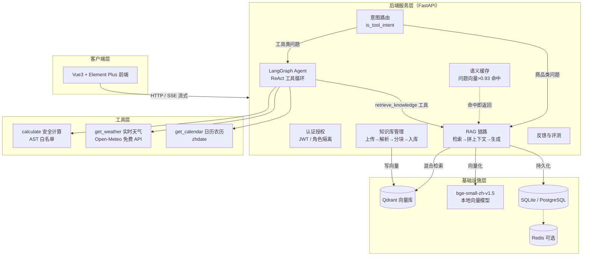

# 企业级 RAG 知识库问答系统

基于 **LangChain** 的电商知识库智能问答系统，支持多文档知识库管理、混合检索增强生成（RAG）、Agent 工具调用（计算 / 天气 / 日历 / 农历）、语义缓存与流式输出，前后端分离并支持 Docker 一键部署上云。

| 检索命中率 hit@5 | 平均检索延迟 | 单元测试 | 技术栈 |
| :-: | :-: | :-: | :-: |
| **100%**（10/10） | **267 ms** | **34 passed** | FastAPI · LangChain · Vue3 |

---

## 功能特性

- 📚 **知识库管理**：多文档上传（PDF / Word / Excel / Markdown），自动解析 → 分块 → 向量化入库，处理状态实时跟踪，支持重新处理与删除
- 🔍 **混合检索 RAG**：稠密检索（Qdrant + bge-small-zh）+ 稀疏检索（jieba + BM25）+ **RRF 融合**，召回率与专有名词命中兼顾
- 🤖 **Agent + RAG 融合**：基于 LangGraph `create_react_agent`，在知识库问答基础上叠加**数学计算、实时天气、日历农历**等工具，与 DeepSeek 通用能力对齐
- 🧭 **意图路由**：`is_tool_intent` 启发式路由，工具类问题走 Agent、商品问题走高性能 RAG，互不拖慢
- ⚡ **语义缓存**：相似问题（余弦相似度 > 0.93）直接命中缓存，避免重复调用大模型，QPS 显著提升
- 🖥️ **SSE 流式对话**：token 级流式输出，实时展示「正在查询天气…」等工具调用状态
- 📄 **引用溯源**：回答自动标注 `[N]` 引用来源，前端仅展示实际引用到的文档名，支持点按追溯
- 🔐 **认证与权限**：JWT 登录、普通用户 / 管理员角色隔离（知识库仅管理员可维护）
- 🛡️ **安全加固**：`slowapi` 限流、计算器 AST 白名单（杜绝 eval 注入）、密码 bcrypt 加密、文件名编码修复
- 🚀 **生产级部署**：Docker Compose 一键部署（Qdrant + 后端 + Nginx 反代），适配 1.6G 内存低配云服务器

---

## 技术栈

| 层 | 技术 |
| --- | --- |
| 前端 | Vue 3 · Vite · Element Plus · Pinia · Axios（SSE 流式解析） |
| 后端 | Python · FastAPI · SQLAlchemy 2.0（异步） · pytest |
| 大模型 | DeepSeek（OpenAI 兼容，支持 function calling） |
| Agent | LangChain · LangGraph（ReAct 循环） · LangChain Tools |
| 向量库 | Qdrant + 本地 bge-small-zh-v1.5（CPU 推理，免 Key） |
| 检索 | jieba 中文分词 · rank-bm25 · RRF 融合 · 可选 bge-reranker 精排 |
| 存储 | SQLite（生产可切换 PostgreSQL） · Redis（可选，语义缓存） |
| 部署 | Docker Compose · Nginx 反向代理 |

---

## 系统架构



**RAG 检索链路**（`retriever.py`）：

```
query ──► 稠密检索（bge 向量 + Qdrant 相似搜索）
     ──► 稀疏检索（jieba 分词 + BM25 关键词打分）
     ──► RRF 融合（按排名倒数加权，无需调参）
     ──► （可选）bge-reranker 交叉编码器精排
     ──► Top-K 上下文注入 → DeepSeek 生成
```

---

## 评测数据

### 检索评测（`scripts/eval_rag.py`，10 个跨品类用例）

| 指标 | 结果 |
| --- | --- |
| hit@5 命中率 | **100%**（10/10，全部用例首条即命中期望文档） |
| @1 命中率 | **100%**（10/10） |
| 平均检索延迟 | **267 ms**（含向量化 + 双路检索 + 融合） |
| P95 检索延迟 | 275 ms |

### 单元测试（`backend/tests/`，34 个用例全部通过）

覆盖：意图路由（`is_tool_intent`）、安全计算器（AST 白名单拒绝 `__import__('os')` 等注入）、日历 / 农历 / 月历、天气缓存命中、GBK 文件名乱码还原、注册 / 登录 / 修改密码 / 管理员权限全链路。

---

## 目录结构

```
├── backend/                 # FastAPI 后端
│   ├── app/
│   │   ├── api/             # 接口层：auth / kb / chat / sessions / admin
│   │   ├── services/        # 核心服务：retriever / rag_chain / agent / tools / cache ...
│   │   ├── core/            # 安全、限流、依赖注入
│   │   ├── models/          # SQLAlchemy 模型（用户/会话/消息/文档/分块）
│   │   ├── schemas/         # Pydantic 请求/响应模型
│   │   └── main.py          # 应用入口（生命周期：建表/种子管理员/恢复中断/建向量集合）
│   ├── tests/               # pytest 测试套件
│   └── requirements.txt
├── frontend/                # Vue3 前端
│   └── src/
│       ├── views/           # 登录 / 对话 / 知识库 / 数据看板
│       ├── components/      # ChatMessage（工具状态/引用溯源/反馈）
│       └── api/             # SSE 流式封装
├── scripts/                 # 工具脚本：下载模型 / 导入知识库 / 评测 / 部署 / 数据修复
├── deploy/                  # 生产部署：Dockerfile / docker-compose / nginx
├── demo_data/               # 演示知识库（8 个品类文档）
└── infra/                   # 本地基础设施（模型 / Qdrant）
```

---

## 快速开始（本地开发）

### 前置依赖

- Python 3.10+，Node 18+，Docker（可选）
- Qdrant：`docker run -d -p 6333:6333 qdrant/qdrant`（或 `infra/qdrant/` 下本地运行）
- 本地向量模型：运行 `backend/.venv/Scripts/python.exe scripts/download_model.py` 下载 bge-small-zh

### 1. 后端

```bash
cd backend
python -m venv .venv
.venv/Scripts/pip install -r requirements.txt
# 配置 backend/.env（DeepSeek Key 等，参照 config.py）
.venv/Scripts/uvicorn app.main:app --host 0.0.0.0 --port 8000 --reload
```

### 2. 导入演示知识库

```bash
cd backend
.venv/Scripts/python.exe ../scripts/seed_kb.py   # 导入 demo_data/ 8 个品类文档
```

### 3. 前端

```bash
cd frontend
npm install
npm run dev          # http://localhost:5173
```

### 4. 运行测试

```bash
cd backend
.venv/Scripts/python.exe -m pytest
```

### 演示账号

| 角色 | 账号 | 密码 |
| --- | --- | --- |
| 管理员（可维护知识库） | `admin` | `123456` |
| 普通用户（仅问答） | 注册即可 | - |

### 演示问题

- 📖 商品类（走 RAG）：*“星辰 X1 Pro 支持多少瓦快充？”*、*“七天无理由退货政策是什么？”*
- 🧮 工具类（走 Agent）：*“1200 块打 85 折再满 300 减 50，最后多少钱？”*
- 🌦️ *“北京今天天气怎么样？”*　🗓️ *“今天是几月几号，农历几号？”*

---

## 生产部署（阿里云 Docker）

1. 上传项目到服务器，编辑 `deploy/.env.production` 配置密钥
2. `cd deploy && docker compose up -d --build`
3. 访问 **http://47.101.151.35:8083**

`docker-compose.yml` 针对 1.6G 内存低配云服务器优化：仅保留 Qdrant + 后端 + Nginx 三个容器，SQLite 持久化，语义缓存降级为进程内存，Nginx 托管前端静态资源并反向代理 API。

---

## 安全说明

- 计算器采用 **AST 白名单**求值，`eval` / `exec` / `__import__` 等均被拒绝
- 接口接入 **slowapi 限流**（可配置开关），防暴力破解与恶意刷量
- 密码 **bcrypt** 加密存储，JWT 访问令牌 + 刷新令牌双令牌机制
- 上传文件名做 **GBK 编码修复**，历史乱码数据提供修复脚本（`scripts/fix_citations.py`）

> ⚠️ 演示仓库 `.env` 不入库；生产部署请务必更换 `SECRET_KEY`、DeepSeek Key 与服务器密码。

## License

MIT
