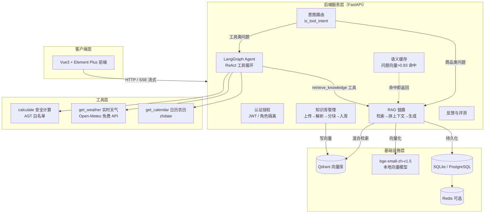

# 企业级 RAG 知识库问答系统

基于 **LangChain** 的企业级电商知识库智能问答系统：多文档知识库管理（含**代码文件解析**）、混合检索增强生成（RAG）、**父子分块**、**Self-RAG 两轮自省**、**会话记忆滚动摘要**、Agent 工具调用（计算 / 天气 / 日历 / 农历）、语义缓存与流式输出，并提供 **RAGAS 真实评测**支撑数据；前后端分离，支持 Docker 一键部署上云。

| RAGAS 忠实度 faithfulness | 检索命中率 hit@1 | 回答通过率（faithfulness≥0.8） | 压测 QPS（缓存命中） | 单元测试 | 技术栈 |
| :-: | :-: | :-: | :-: | :-: | :-: |
| **0.88**（64 条真实评测） | **84.4%**（hit@3 89.1% / hit@5 90.6%） | **75.0%**（48/64） | **36 QPS**（P50 64ms） | **91 passed** | FastAPI · LangChain · Vue3 |

---

## 功能特性

- 📚 **知识库管理**：多文档上传（PDF / Word / Excel / Markdown / **18 种代码文件**），自动解析 → 分块 → 向量化入库，处理状态实时跟踪，支持重新处理与删除
- 🔍 **混合检索 RAG**：稠密检索（Qdrant + bge-small-zh）+ 稀疏检索（jieba + BM25）+ **RRF 融合**，召回率与专有名词命中兼顾
- 📑 **父子分块**：标题 / 代码定义块为父块、子块负责嵌入检索，LLM 上下文用**父块全文**——语义完整性与引用细粒度（子块）兼得
- 💻 **代码文件解析**：按顶层 `class` / `def` 等定义块切分源码，可直接对代码文件问答（例：`get_user` 方法的作用）
- 🔄 **Self-RAG 两轮自省**：生成后由 critic 模型对照检索上下文逐条核对事实性陈述（数字 / 型号 / 参数 / 政策），发现问题自动改写（≤2 轮），完成后分块流式推送，`done` 事件带反思信息
- 🧠 **会话记忆滚动摘要**：长对话超阈值后把更早消息**折叠成摘要**注入系统上下文，突破"只记最近 N 条"的硬上限
- 🧮 **RAGAS 真实评测**：隔离 `.venv-eval` + 固定版本跑真实 ragas 库，DeepSeek 判分，产出 faithfulness / hit@k 报告（可复现，详见 [docs/RAGAS评估说明.md](docs/RAGAS评估说明.md)）
- 🤖 **Agent + RAG 融合**：基于 LangGraph `create_react_agent`，在知识库问答基础上叠加**数学计算、实时天气、日历农历**等工具，与 DeepSeek 通用能力对齐
- 🧭 **意图路由**：`is_tool_intent` 启发式路由，工具类问题走 Agent、商品问题走高性能 RAG，互不拖慢
- ⚡ **语义缓存**：相似问题（余弦相似度 > 0.93）直接命中缓存，避免重复调用大模型，QPS 显著提升
- 🖥️ **SSE 流式对话**：token 级流式输出，实时展示「正在查询天气…」等工具调用状态
- 📄 **引用溯源**：回答自动标注 `[N]` 引用来源，前端仅展示实际引用到的文档名，支持点按追溯
- 🔌 **MCP 集成**：知识库问答能力暴露为标准 MCP 工具集，Claude Code / Claude Desktop / Cursor 等客户端可直接检索、问答（`kb_search` / `kb_ask` / `kb_agent` / `kb_stats` / `kb_documents`），支持 stdio 与 Streamable HTTP 双运输
- 🔐 **认证与权限**：JWT 登录、普通用户 / 管理员角色隔离（知识库仅管理员可维护）
- 🛡️ **安全加固**：`slowapi` 限流、计算器 AST 白名单（杜绝 eval 注入）、密码 bcrypt 加密、文件名编码修复
- 🚀 **生产级部署**：Docker Compose 一键部署（Qdrant + 后端 + Nginx 反代），适配 1.6G 内存低配云服务器

---

## 技术栈

| 层 | 技术 |
| --- | --- |
| 前端 | Vue 3 · Vite · Element Plus · Pinia · Axios（SSE 流式解析） |
| 后端 | Python · FastAPI · SQLAlchemy 2.0（异步） · pytest |
| 大模型 | DeepSeek（OpenAI 兼容，支持 function calling） |
| Agent | LangChain · LangGraph（ReAct 循环） · LangChain Tools |
| MCP | Model Context Protocol（mcp SDK，stdio / Streamable HTTP） |
| 向量库 | Qdrant + 本地 bge-small-zh-v1.5（CPU 推理，免 Key） |
| 检索 | jieba 中文分词 · rank-bm25 · RRF 融合 · 可选 bge-reranker 精排 |
| 分块 | 父子分块（标题 / 代码定义块）+ 代码语言级切块 · 滚动摘要会话记忆 |
| 评测 | RAGAS（隔离 `.venv-eval` + 固定版本，DeepSeek judge） |
| 存储 | SQLite（生产可切换 PostgreSQL） · Redis（可选，语义缓存） |
| 部署 | Docker Compose · Nginx 反向代理 |

---

## 系统架构



**RAG 检索链路**（`retriever.py`）：

```
query ──► 稠密检索（bge 向量 + Qdrant 相似搜索）
     ──► 稀疏检索（jieba 分词 + BM25 关键词打分）
     ──► RRF 融合（按排名倒数加权，无需调参）
     ──► （可选）bge-reranker 交叉编码器精排
     ──► Top-K 上下文注入 → DeepSeek 生成
```

---

## 评测数据

### RAGAS 真实评测（`scripts/eval_ragas.py`，64 条跨品类 golden）

由**真实 ragas 库**（隔离 `.venv-eval`，固定版本）跑出，DeepSeek 判分，不修数。评估数据：`scripts/eval_golden.json`（9 个 demo 文档：8 电商品类 + 1 代码文档，共 **64 条**）。

| 指标 | 结果 |
| --- | --- |
| **faithfulness**（忠实度，LLM-only） | **0.88**（低分案例均为回答超出检索上下文所致，如补引了未命中的分块） |
| **回答通过率**（faithfulness ≥ 0.8） | **75.0%**（48/64，默认口径；≥0.7 为 85.9%） |
| hit@1 命中率 | **84.4%**（54/64） |
| hit@3 / hit@5 命中率 | **89.1%**（57/64） / **90.6%**（58/64） |
| 平均单条生成延迟 | **2.13 s**（检索 + 生成全链路） |

> 未配置 `EMBEDDING_API_KEY`，故 `answer_relevancy` / `context_recall` / `context_precision` 未跑；填入 SiliconFlow Key 后重跑即可出全量指标。复现步骤与降级链见 **[docs/RAGAS评估说明.md](docs/RAGAS评估说明.md)**。

### 接口压测（`scripts/load_test.py`，本地 uvicorn 实测）

关闭业务限流后测量系统真实容量（生产默认保留 20 次/分/用户限流防配额滥用）：

| 场景 | 请求数 | QPS | 平均延迟 | P50 | P90 | P99 |
| --- | --- | --- | --- | --- | --- | --- |
| **缓存命中路径**（语义缓存，不调用 LLM） | 60 | **36.0** | 225ms | 64ms | 932ms | 1664ms |
| **冷路径**（混合检索 + Self-RAG + DeepSeek 首答） | 12 | 0.6 | 3953ms | 3035ms | 3284ms | 14983ms |

> 缓存命中路径仍包含 query 向量化 + 会话/消息落库，是接口真实吞吐；冷路径受 DeepSeek LLM 延迟约束，代表首次提问的真实首答能力。

### 检索评测（`scripts/eval_rag.py`，10 个跨品类用例）

| 指标 | 结果 |
| --- | --- |
| hit@5 命中率 | **100%**（10/10，全部用例首条即命中期望文档） |
| @1 命中率 | **100%**（10/10） |
| 平均检索延迟 | **267 ms**（含向量化 + 双路检索 + 融合） |
| P95 检索延迟 | 275 ms |

### 单元测试（`backend/tests/`，91 个用例全部通过）

覆盖：代码文件解析 / 代码分块、父子分块（结构化分块 / DB 列 / 检索 parent_content / 上下文回退）、Self-RAG 五分支（禁用 / pass / revise / 坏 JSON / LLM 异常）、会话记忆滚动摘要（超阈值压缩 / 幂等 / LLM 异常降级 / 最近 N 条顺序）、RAGAS golden 与数据集结构校验、意图路由、安全计算器（AST 白名单拒绝 `__import__('os')` 等注入）、日历 / 农历 / 月历、天气缓存命中、GBK 文件名乱码还原、注册 / 登录 / 修改密码 / 管理员权限全链路，以及 MCP 服务器（工具注册 / 参数 schema / 降级行为）。

> 另有 MCP 端到端冒烟：`scripts/test_mcp_stdio.py`（stdio 裸协议，真实调用 5 个工具）与 `scripts/test_mcp_http.py`（HTTP 协议）。

---

## 目录结构

```
├── backend/                 # FastAPI 后端
│   ├── app/
│   │   ├── api/             # 接口层：auth / kb / chat / sessions / admin
│   │   ├── services/        # retriever / rag_chain / agent / self_rag / memory / chunker / cache ...
│   │   ├── mcp/             # MCP 服务器（server.py：5 个知识库工具）
│   │   ├── core/            # 安全、限流、依赖注入
│   │   ├── models/          # SQLAlchemy 模型（用户/会话/消息/文档/分块）
│   │   ├── schemas/         # Pydantic 请求/响应模型
│   │   └── main.py          # 应用入口（生命周期：建表/迁移/种子管理员/恢复中断/建向量集合）
│   ├── run_mcp_server.py    # MCP 入口（stdio / Streamable HTTP 双运输）
│   ├── tests/               # pytest 测试套件（91 用例，含 test_mcp.py）
│   └── requirements.txt
├── frontend/                # Vue3 前端
│   └── src/
│       ├── views/           # 登录 / 对话 / 知识库 / 数据看板
│       ├── components/      # ChatMessage（工具状态/引用溯源/反馈）
│       └── api/             # SSE 流式封装
├── scripts/                 # 下载模型 / 导入知识库 / 重建索引 / 评测 / 部署 / MCP 冒烟
│   └── eval_output/         # RAGAS 评估数据集与报告（gen_eval_data.py / eval_ragas.py 产出）
├── docs/                    # 文档：mcp/ 接入指南、RAGAS 评估说明
├── deploy/                  # 生产部署：Dockerfile / docker-compose / nginx
├── demo_data/               # 演示知识库（8 电商品类 + 1 个代码示例接口示例.py）
├── infra/                   # 本地基础设施（模型 / Qdrant）
└── .mcp.json                # Claude Code 一键接入配置
```

---

## 快速开始（本地开发）

### 前置依赖

- Python 3.10+，Node 18+，Docker（可选）
- Qdrant：`docker run -d -p 6333:6333 qdrant/qdrant`（或 `infra/qdrant/` 下本地运行）
- 本地向量模型：运行 `backend/.venv/Scripts/python.exe scripts/download_model.py` 下载 bge-small-zh

### 1. 后端

```bash
cd backend
python -m venv .venv
.venv/Scripts/pip install -r requirements.txt
# 配置 backend/.env（DeepSeek Key 等，参照 config.py）
.venv/Scripts/uvicorn app.main:app --host 0.0.0.0 --port 8000 --reload
```

### 2. 导入演示知识库

```bash
cd backend
.venv/Scripts/python.exe ../scripts/seed_kb.py   # 导入 demo_data/ 9 个演示文档（8 品类 + 接口示例.py）
# 分块策略升级后重建索引（让旧库 chunk 补上 parent_content）：
.venv/Scripts/python.exe ../scripts/reindex_kb.py
```

### 3. 前端

```bash
cd frontend
npm install
npm run dev          # http://localhost:5173
```

### 4. 运行测试

```bash
cd backend
.venv/Scripts/python.exe -m pytest    # 91 个用例
```

### 5. RAGAS 真实评测（复现报告里的数字）

```bash
cd backend
.venv/Scripts/python.exe ../scripts/gen_eval_data.py    # 检索 + DeepSeek 生成 64 条评估数据
.venv/Scripts/python.exe ../scripts/eval_ragas.py       # 自动建隔离 .venv-eval 并评测，产出 ragas_report_*.md（含通过率）
# 压测（需本地起后端，见脚本注释）：产出 load_test_report_*.md
.venv/Scripts/python.exe ../scripts/load_test.py --base http://127.0.0.1:8001
```

### 演示账号

| 角色 | 账号 | 密码 |
| --- | --- | --- |
| 管理员（可维护知识库） | `admin` | `123456` |
| 普通用户（仅问答） | 注册即可 | - |

### 演示问题

- 📖 商品类（走 RAG）：*“星辰 X1 Pro 支持多少瓦快充？”*、*“七天无理由退货政策是什么？”*
- 💻 代码类（代码文件问答）：*“UserService 的 get_user 方法如果用户不存在会怎样？”*
- 🧮 工具类（走 Agent）：*“1200 块打 85 折再满 300 减 50，最后多少钱？”*
- 🌦️ *“北京今天天气怎么样？”*　🗓️ *“今天是几月几号，农历几号？”*

---

## MCP 集成（让 AI 客户端直连知识库）

项目通过 **MCP（Model Context Protocol）** 把知识库问答能力暴露为标准工具集，任何支持 MCP 的客户端（Claude Code / Claude Desktop / Cursor）都能直接检索知识库、提问并获得带引用的答案。

```bash
# stdio（本机直连，Claude Code 已内置 .mcp.json 配置）
cd backend && .venv/Scripts/python.exe run_mcp_server.py

# 或 Streamable HTTP（远程访问）
cd backend && .venv/Scripts/python.exe run_mcp_server.py --transport http --host 127.0.0.1 --port 8001
```

- 工具：`kb_search` / `kb_ask` / `kb_agent` / `kb_stats` / `kb_documents`（全部只读）
- 验证：`scripts/test_mcp_stdio.py`（全协议冒烟，真实调用 5 个工具）
- 完整接入说明见 **[docs/mcp/接入指南.md](docs/mcp/接入指南.md)**

## 生产部署（阿里云 Docker）

1. 上传项目到服务器，编辑 `deploy/.env.production` 配置密钥
2. `cd deploy && docker compose up -d --build`
3. 访问 **http://47.101.151.35/**（Nginx 托管前端 + 反代 API；`scripts/deploy.py` 一键部署）

`docker-compose.yml` 针对 1.6G 内存低配云服务器优化：仅保留 Qdrant + 后端 + Nginx 三个容器，SQLite 持久化，语义缓存降级为进程内存，Nginx 托管前端静态资源并反向代理 API。

---

## 安全说明

- 计算器采用 **AST 白名单**求值，`eval` / `exec` / `__import__` 等均被拒绝
- 接口接入 **slowapi 限流**（可配置开关），防暴力破解与恶意刷量
- 密码 **bcrypt** 加密存储，JWT 访问令牌 + 刷新令牌双令牌机制
- 上传文件名做 **GBK 编码修复**，历史乱码数据提供修复脚本（`scripts/fix_citations.py`）

> ⚠️ 演示仓库 `.env` 不入库；生产部署请务必更换 `SECRET_KEY`、DeepSeek Key 与服务器密码。

## License

MIT
